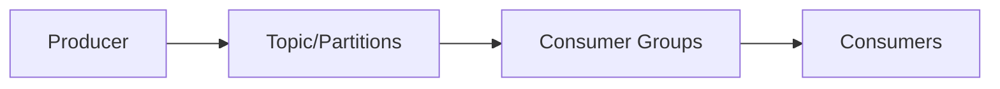
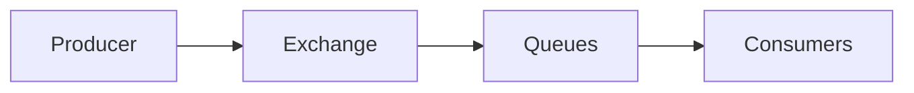

# Сравнение Kafka, NATS и RabbitMQ

## Основные характеристики

| Особенность | Kafka | NATS | RabbitMQ |
|-------------|-------|------|----------|
| **Гарантии доставки** | ✅ At-least-once, Exactly-once (с Kafka Streams) ❌ At-most-once (по умолчанию) | ❌ At-most-once (Core NATS) ✅ At-least-once, Exactly-once (JetStream) | ✅ At-least-once, At-most-once, Exactly-once |
| **Горизонтальное масштабирование** | ✅ Отличное - кластеризация из коробки Шардинг по партициям | ✅ Хорошее - кластеризация JetStream поддерживает репликацию | ✅ Хорошее - кластеризация и шардинг Требует настройки |
| **Web UI** | Kafka UI (port 8080) Требует отдельную установку | Web UI из коробки урезанный, нельзя отправить сообщение | Management UI (port 15672) Богатый функционал |
| **Сложность развертывания** | 🔴 Сложно - требует Zookeeper/KRaft Много компонентов | 🟢 Просто - один бинарный файл Минимальная конфигурация | 🟡 Средне - требует настройки кластера Erlang зависимости |
| **Потребление ресурсов** | 🔴 Высокое - JVM + диск ~512MB RAM минимум | 🟢 Низкое - Go, ~50MB RAM Очень эффективный | 🟡 Средне - Erlang VM ~100-200MB RAM |

## Дополнительные характеристики

| Особенность | Kafka | NATS | RabbitMQ |
|-------------|-------|------|----------|
| **Производительность** | 🟢 Высокая пропускная способность Задержка 10-100ms | 🟢 Очень низкая задержка ~100μs latency | 🟡 Средняя производительность 1-10ms latency |
| **Персистентность** | ✅ Встроенная (логи) Настраиваемое время хранения | ❌ Нет (Core NATS) ✅ Есть (JetStream) | ✅ Встроенная Очереди и exchange |
| **Протоколы** | Собственный TCP HTTP через REST Proxy | Собственный TCP WebSocket, HTTP/2 | AMQP 0.9.1, STOMP MQTT, HTTP |
| **Языки поддержки** | Java, Go, Python, C++, .NET Очень широкий выбор | Go, Java, Python, Node.js C#, C++, Rust | Java, Go, Python, .NET PHP, Ruby, JavaScript |
| **Маршрутизация** | Партиции по ключам Простая схема | Subjects с wildcards Иерархическая | Exchange + Routing Keys Очень гибкая |
| **Использование** | Big Data, Event Streaming Микросервисы | Микросервисы, IoT Real-time приложения | Enterprise messaging Микросервисы |

## Архитектурные различия

### Kafka - Event Streaming Platform

- **Модель**: Append-only log
- **Хранение**: Долгосрочное хранение событий
- **Масштабирование**: Партиции для параллелизма

### NATS - Cloud Native Messaging

- **Модель**: Pub/Sub с опциональной персистентностью
- **Хранение**: В памяти (Core) или JetStream
- **Масштабирование**: Горизонтальное через кластеры

### RabbitMQ - Message Broker

- **Модель**: Message queuing с routing
- **Хранение**: Дисковое хранение с репликацией
- **Масштабирование**: Кластеры и шардинг

## Рекомендации по выбору

### Выбирайте **Kafka** если:
- Нужна высокая пропускная способность (миллионы сообщений/сек)
- Важна долгосрочная персистентность данных
- Строите event-driven архитектуру
- Нужен replay сообщений
- Обрабатываете большие объемы данных

### Выбирайте **NATS** если:
- Нужна минимальная задержка (микросекунды)
- Простота развертывания критична
- Минимальное потребление ресурсов
- Real-time коммуникация
- Микросервисная архитектура с простыми паттернами

### Выбирайте **RabbitMQ** если:
- Нужны сложные паттерны маршрутизации
- Требуется поддержка множества протоколов
- Enterprise-grade надежность
- Богатый Web UI для администрирования
- Гибкость в настройке доставки сообщений
- Нужны dead letter queues и retry механизмы

## Практические соображения

### Сложность внедрения
1. **NATS** - самый простой для начала
2. **RabbitMQ** - средняя сложность, хорошая документация
3. **Kafka** - самый сложный, требует экспертизы

### Операционные расходы
1. **NATS** - минимальные ресурсы и обслуживание
2. **RabbitMQ** - средние, требует мониторинга
3. **Kafka** - высокие, нужна специализированная команда

### Экосистема
1. **Kafka** - самая богатая экосистема (Kafka Connect, Streams, etc.)
2. **RabbitMQ** - зрелая экосистема с множеством плагинов
3. **NATS** - растущая экосистема, фокус на cloud-native