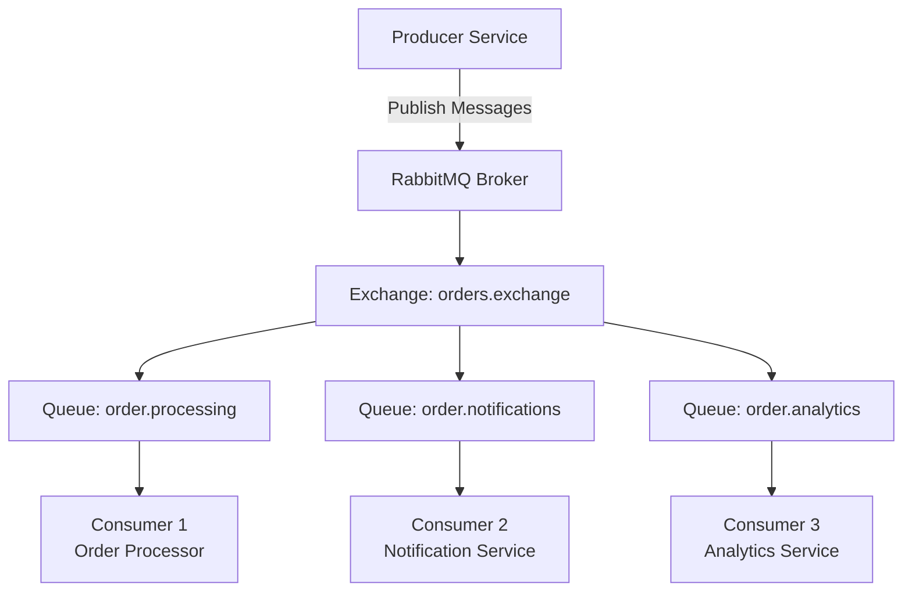
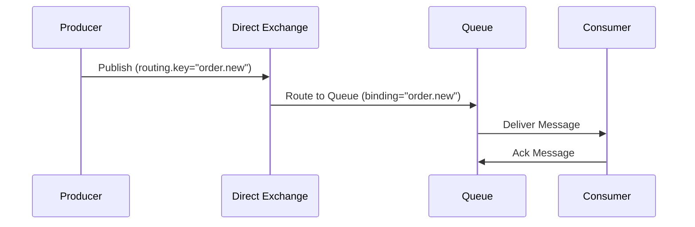
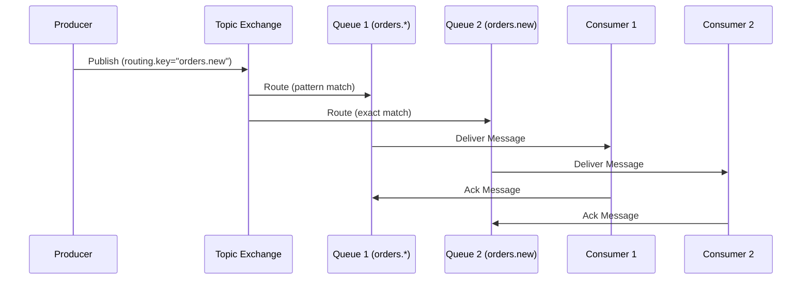
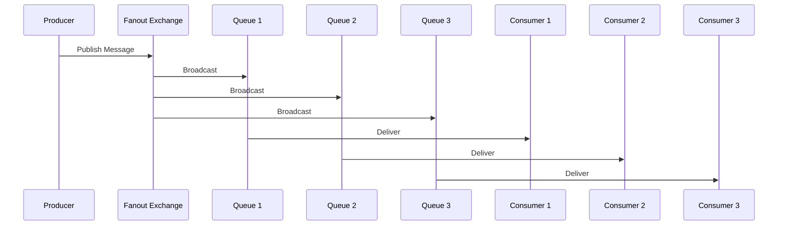
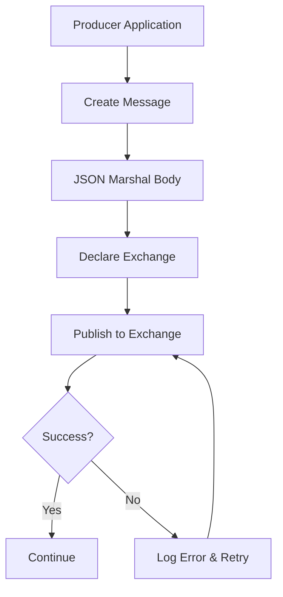
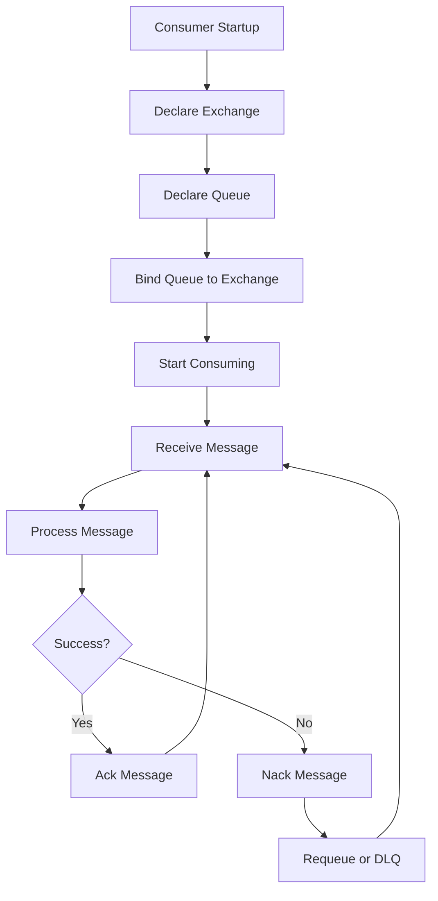
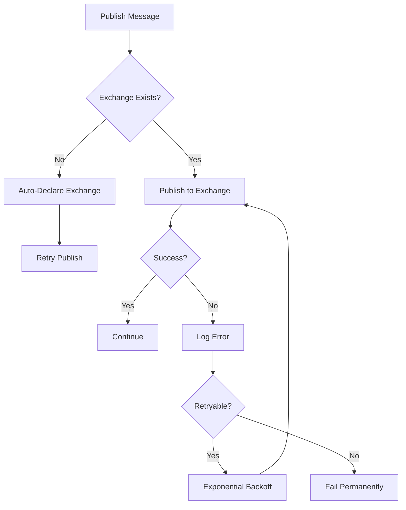
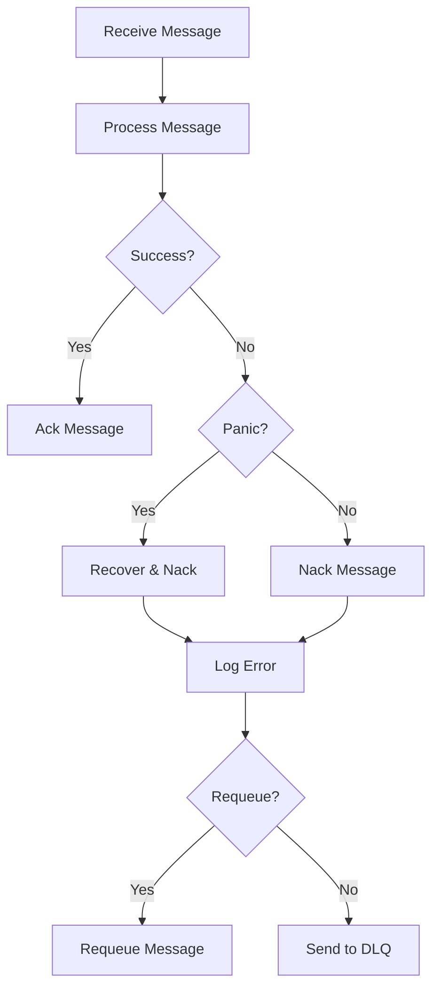
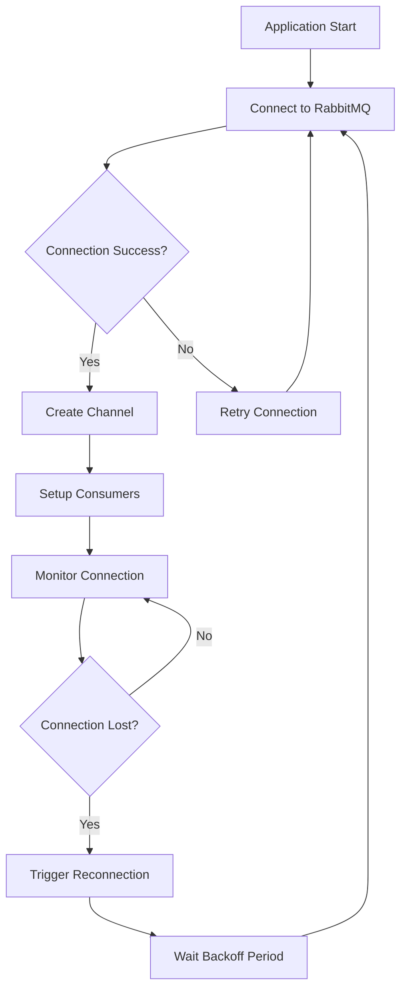

# RabbitMQ Data Flow Documentation

## Overview

This document explains how data flows through the RabbitMQ platform implementation, covering producer-to-consumer message flow, exchange routing strategies, and queue management patterns.

## Architecture Overview



## RabbitMQ Core Entities

### 1. **Exchanges** (Message Routing)
- **Purpose**: Route messages to queues based on routing rules
- **Types**: Direct, Topic, Fanout, Headers
- **Routing**: Uses routing keys and binding patterns

### 2. **Queues** (Message Storage)
- **Purpose**: Store messages until consumed
- **Features**: Durability, TTL, dead letter handling
- **FIFO**: First-in-first-out message delivery

### 3. **Bindings** (Routing Rules)
- **Purpose**: Link exchanges to queues with routing patterns
- **Patterns**: Exact match, wildcard patterns (`*`, `#`)
- **Multiple**: One queue can have multiple bindings

### 4. **Messages** (Data Carriers)
- **Purpose**: Carry application data with metadata
- **Features**: Headers, routing key, body, properties
- **Format**: JSON serialized message bodies

## Message Flow Patterns

### 1. **Direct Exchange Routing**



**Characteristics:**
- Exact routing key match
- One-to-one message delivery
- Simple and predictable routing

### 2. **Topic Exchange Routing**



**Characteristics:**
- Pattern-based routing with wildcards
- One-to-many message delivery
- Flexible routing logic

### 3. **Fanout Exchange Broadcasting**



**Characteristics:**
- Broadcast to all bound queues
- Ignores routing keys
- Useful for notifications and logging

## Platform Implementation Flow

### Producer Message Flow



**Producer Flow Details:**
1. **Message Creation**: Application creates message with routing key and body
2. **JSON Serialization**: Message body automatically marshaled to JSON
3. **Exchange Declaration**: Topic exchange auto-declared if not exists
4. **Publishing**: Message published with context support
5. **Error Handling**: Automatic retry on transient failures

### Consumer Message Flow



**Consumer Flow Details:**
1. **Setup Phase**: Declare exchanges, queues, and bindings
2. **Message Consumption**: Start consuming messages from queue
3. **Message Processing**: Execute custom processing function
4. **Acknowledgment**: Manual ack/nack based on processing result
5. **Error Recovery**: Panic recovery with automatic nack

## Routing Strategies

### Key-Based Routing (Direct)

```go
// Producer publishes with specific routing key
publisher.Publish(ctx, "orders.exchange", "order.new", orderData)

// Consumer binds to exact routing key
consumer := Consumer{
    Exchange:   "orders.exchange",
    QueueName:  "order.processing",
    RoutingKey: "order.new",
}
```

**Benefits:**
- Predictable message routing
- Simple one-to-one delivery
- Easy to understand and debug

### Pattern-Based Routing (Topic)

```go
// Producer publishes with hierarchical routing key
publisher.Publish(ctx, "events.exchange", "user.profile.updated", userData)

// Consumer binds with wildcard pattern
consumer := Consumer{
    Exchange:   "events.exchange", 
    QueueName:  "user.events",
    RoutingKey: "user.*",  // Matches user.profile.updated, user.login, etc.
}
```

**Wildcard Patterns:**
- `*` - matches exactly one word
- `#` - matches zero or more words
- Example: `orders.#` matches `orders.new`, `orders.new.priority`, etc.

### Broadcast Routing (Fanout)

```go
// All bound queues receive the message regardless of routing key
publisher.Publish(ctx, "broadcast.exchange", "", broadcastData)
```

## Message Transformation and Processing

### Message Structure

```go
type Message struct {
    Exchange    string
    RoutingKey  string
    Headers     map[string]interface{}
    Body        []byte
    Timestamp   time.Time
    MessageID   string
}
```

### JSON Message Processing

```go
func handleOrderMessage(msg amqp.Delivery) {
    var order Order
    if err := json.Unmarshal(msg.Body, &order); err != nil {
        slog.Error("failed to unmarshal order", "error", err)
        return
    }
    
    // Process order
    if err := processOrder(order); err != nil {
        slog.Error("failed to process order", "error", err)
        return
    }
    
    slog.Info("order processed successfully", "order_id", order.ID)
}
```

## Error Handling Flow

### Producer Error Handling



### Consumer Error Handling



## Connection Management Flow

### Connection Lifecycle



### Reconnection Strategy

```go
func (c *RabbitMQClient) monitorReconnect() {
    for {
        notify := c.conn.Conn.NotifyClose(make(chan *amqp.Error))
        err := <-notify
        
        if err != nil {
            slog.Error("rabbitmq connection closed", "error", err)
            
            // Exponential backoff reconnection
            for {
                time.Sleep(c.reconnectTime)
                if err := c.connectAndDeclare(); err != nil {
                    slog.Error("reconnect failed", "error", err)
                    c.reconnectTime *= 2 // Exponential backoff
                    continue
                }
                
                slog.Info("reconnected to RabbitMQ")
                c.launchConsumers() // Restart all consumers
                c.reconnectTime = 5 * time.Second // Reset backoff
                break
            }
        }
    }
}
```

## Monitoring and Observability

### Key Metrics Tracked

1. **Producer Metrics:**
   - Messages published per second
   - Publishing success/failure rates
   - Exchange declaration events

2. **Consumer Metrics:**
   - Messages consumed per second
   - Processing success/failure rates
   - Queue depth and consumer lag

3. **Connection Metrics:**
   - Connection status and uptime
   - Reconnection frequency
   - Channel utilization

### RabbitMQ Management UI

Access RabbitMQ Management at:
- **URL**: http://localhost:15672
- **Credentials**: guest/guest (default)

**Features:**
- Queue and exchange monitoring
- Message rates and statistics
- Consumer connection status
- Message browsing and management