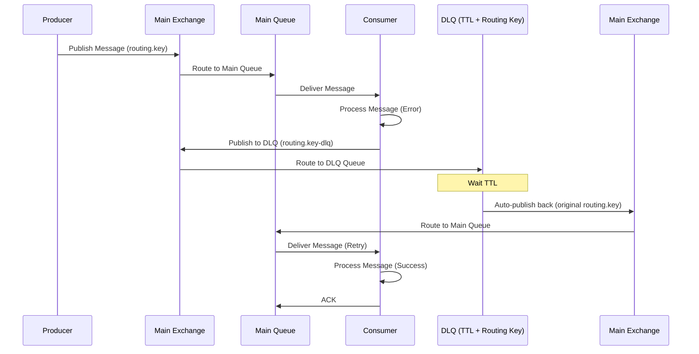

# Dead Letter Queue (DLQ) Implementation

## DLQ Flow Architecture



## TTL-Based DLQ Data Flow Summary

The TTL-based DLQ implementation provides an elegant, native RabbitMQ solution:

1. **Message Flow**: Producer → Main Exchange → Main Queue → Consumer
2. **Error Handling**: Failed messages → Publish to DLQ routing key → DLQ with TTL
3. **Automatic Retry**: TTL expiration → Auto-publish back to main queue (original routing key)
4. **Retry Tracking**: x-death headers track attempt count
5. **Routing Separation**: DLQ uses separate routing keys to avoid circular routing

### **DLQ Routing Key Strategy**

To avoid circular routing, DLQ uses **separate routing keys**:

```
Main Queue:     "orders.process"     (bound to main exchange)
DLQ Queue:      "orders.process-dlq" (bound to main exchange)
```

**Flow:**
1. **Normal**: Message → `orders.process` → Main Queue → Consumer
2. **Error**: Consumer → Publish to `orders.process-dlq` → DLQ Queue
3. **TTL Expires**: DLQ → Auto-republish to `orders.process` → Main Queue (retry)

### **x-death Header Tracking**

Message headers automatically track retry attempts:

```json
{
  "x-death": [
    {
      "count": 2,
      "reason": "rejected",
      "queue": "orders.processing-dlq",
      "time": "2024-01-01T10:00:00Z",
      "exchange": "orders.exchange",
      "routing-keys": ["orders.process-dlq"]
    }
  ]
}
```

```bash
# Check queue status and TTL configuration
rabbitmqctl list_queues name messages arguments

# Check DLQ TTL settings
rabbitmqctl list_queues name arguments | grep -E "(ttl|dead-letter)"

# Inspect message headers for x-death
rabbitmqctl list_queues name messages

# Check exchange bindings for return routing
rabbitmqctl list_bindings

# Monitor DLQ queues specifically
rabbitmqctl list_queues name messages | grep dlq
```

