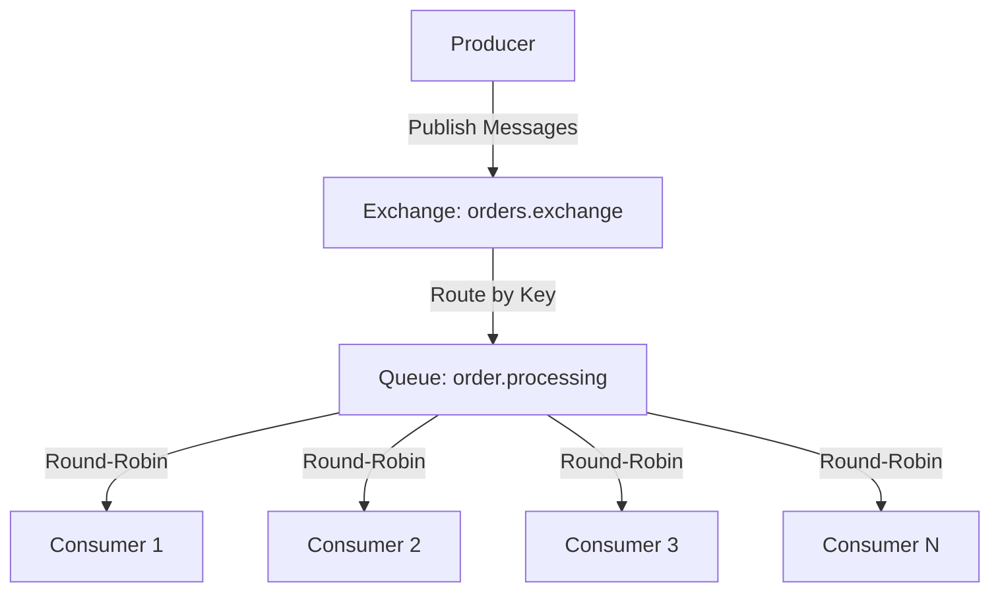
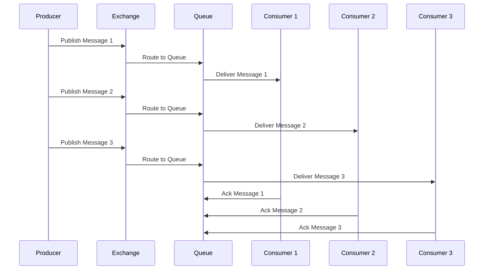
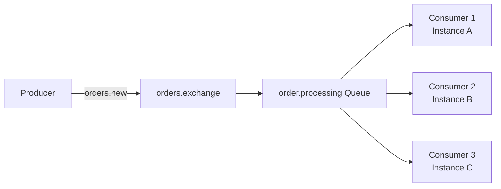
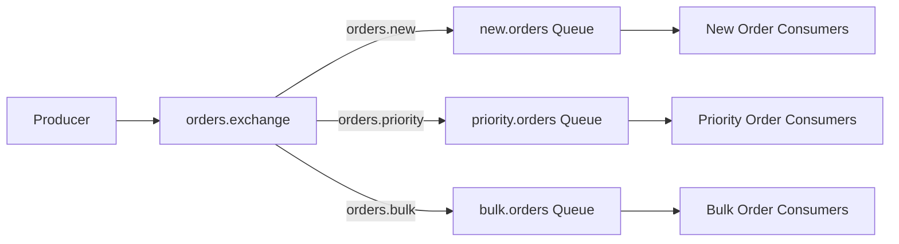
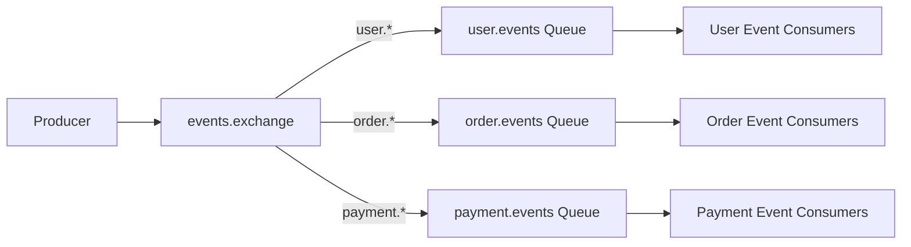
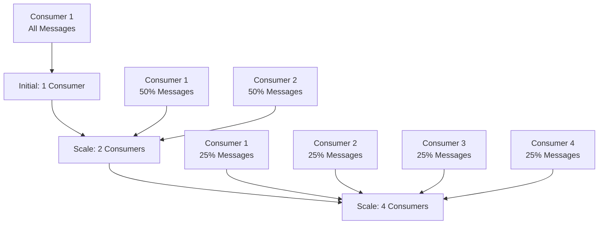

# RabbitMQ Load Balancing Documentation

## Overview

RabbitMQ provides sophisticated load balancing through queue-based message distribution. This document covers how RabbitMQ distributes messages across multiple consumers for efficient processing and horizontal scaling.

## RabbitMQ Load Balancing Mechanisms

### How RabbitMQ Distributes Work



**Key Principles:**
- Multiple consumers can consume from the same queue
- Messages are distributed round-robin among available consumers
- Each message is delivered to only one consumer
- Consumers acknowledge messages individually

## Queue-Based Load Balancing

### Multiple Consumers per Queue



**Load Balancing Features:**
- **Round-Robin Distribution**: Messages distributed evenly across consumers
- **Fair Dispatch**: Each consumer gets approximately equal number of messages
- **Consumer Acknowledgment**: Manual ack ensures message processing completion
- **Automatic Failover**: Failed consumers automatically excluded from distribution

## Platform Implementation

### Consumer Configuration

```go
type Consumer struct {
    RoutingKey  string
    QueueName   string
    Exchange    string
    ProcessFunc func(msg amqp.Delivery)
}

// Multiple consumers can share the same queue
consumers := []Consumer{
    {
        Exchange:    "orders.exchange",
        QueueName:   "order.processing",  // Same queue
        RoutingKey:  "orders.*",
        ProcessFunc: handleOrderMessage,
    },
    {
        Exchange:    "orders.exchange", 
        QueueName:   "order.processing",  // Same queue
        RoutingKey:  "orders.*",
        ProcessFunc: handleOrderMessage,
    },
}
```

### Load Balancing Strategies

#### 1. **Single Queue, Multiple Consumers**



**Benefits:**
- Simple setup and configuration
- Automatic load distribution
- Easy horizontal scaling
- Built-in failover

#### 2. **Multiple Queues, Specialized Consumers**



**Benefits:**
- Specialized processing per message type
- Independent scaling per queue
- Priority-based processing
- Resource isolation

#### 3. **Topic-Based Load Balancing**



**Benefits:**
- Pattern-based message routing
- Domain-specific load balancing
- Flexible routing rules
- Easy to add new message types

## Consumer Scaling Patterns

### Horizontal Scaling



**Scaling Benefits:**
- Linear performance improvement
- No configuration changes needed
- Automatic load redistribution
- Easy deployment and management

### Consumer Prefetch Control

```go
// Set prefetch count to control message distribution
err := channel.Qos(
    1,     // prefetch count - number of unacked messages per consumer
    0,     // prefetch size - 0 means no limit
    false, // global - apply to channel or connection
)
```

**Prefetch Benefits:**
- **Fair Distribution**: Prevents fast consumers from hogging messages
- **Memory Control**: Limits memory usage per consumer
- **Processing Control**: Ensures even workload distribution
- **Quality of Service**: Better overall system performance

## Load Balancing Scenarios

### Scenario 1: Equal Load Distribution

```
Producer sends: [msg1, msg2, msg3, msg4, msg5, msg6]
Queue: order.processing

Consumer 1: [msg1, msg4] (Round-robin)
Consumer 2: [msg2, msg5] (Round-robin)
Consumer 3: [msg3, msg6] (Round-robin)

Result: Perfect load distribution
```

### Scenario 2: Consumer Failure

```
Initial State:
- Consumer 1: Processing msg1
- Consumer 2: Processing msg2
- Consumer 3: Processing msg3

Consumer 2 Fails:
- msg2 returns to queue (no ack received)
- Consumer 1 or 3 picks up msg2
- New messages distributed between Consumer 1 and 3

Result: Automatic failover, no message loss
```

### Scenario 3: Consumer Recovery

```
During Failure:
- Consumer 1: Handling 50% of messages
- Consumer 3: Handling 50% of messages

Consumer 2 Recovers:
- Rejoins the queue consumption
- Load automatically redistributed to 33% each

Result: Automatic rebalancing, improved performance
```

### Scenario 4: Slow Consumer Handling

```
With Prefetch Count = 1:
- Fast Consumer: Gets next message immediately after ack
- Slow Consumer: Only gets one message until it acks
- Queue: Automatically routes more messages to fast consumer

Result: Adaptive load balancing based on processing speed
```

## Advanced Load Balancing Features

### Message Priority

```go
// Publish with priority
err := channel.Publish(
    exchange,
    routingKey,
    false,
    false,
    amqp.Publishing{
        Priority: 5, // Higher priority messages processed first
        Body:     messageBody,
    },
)
```

### Dead Letter Queues (DLQ)

```go
// Queue with dead letter exchange for failed messages
_, err := channel.QueueDeclare(
    "order.processing",
    true,  // durable
    false, // delete when unused
    false, // exclusive
    false, // no-wait
    amqp.Table{
        "x-dead-letter-exchange":    "failed.exchange",
        "x-dead-letter-routing-key": "failed.orders",
        "x-message-ttl":             300000, // 5 minutes TTL
    },
)
```

### Consumer Groups Simulation

```go
// Simulate consumer groups by using same queue name
func createConsumerGroup(groupName string, consumerCount int) {
    for i := 0; i < consumerCount; i++ {
        consumer := Consumer{
            Exchange:    "orders.exchange",
            QueueName:   fmt.Sprintf("%s.queue", groupName),
            RoutingKey:  "orders.*",
            ProcessFunc: handleMessage,
        }
        go startConsumer(consumer)
    }
}

// Usage
createConsumerGroup("order-processors", 3)  // 3 consumers sharing same queue
createConsumerGroup("audit-processors", 2)  // 2 consumers sharing different queue
```

## Performance Optimization

### Batch Processing

```go
func batchConsumer(msgs <-chan amqp.Delivery) {
    batch := make([]amqp.Delivery, 0, 10)
    ticker := time.NewTicker(1 * time.Second)
    
    for {
        select {
        case msg := <-msgs:
            batch = append(batch, msg)
            if len(batch) >= 10 {
                processBatch(batch)
                batch = batch[:0] // Reset batch
            }
            
        case <-ticker.C:
            if len(batch) > 0 {
                processBatch(batch)
                batch = batch[:0] // Reset batch
            }
        }
    }
}
```

### Connection Pooling

```go
type ConnectionPool struct {
    connections []*amqp.Connection
    channels    []*amqp.Channel
    mu          sync.Mutex
    index       int
}

func (p *ConnectionPool) GetChannel() *amqp.Channel {
    p.mu.Lock()
    defer p.mu.Unlock()
    
    channel := p.channels[p.index]
    p.index = (p.index + 1) % len(p.channels)
    return channel
}
```

## Monitoring Load Balancing

### Key Metrics

1. **Queue Metrics:**
   - Queue depth (messages waiting)
   - Consumer count per queue
   - Message rates (in/out)

2. **Consumer Metrics:**
   - Messages processed per consumer
   - Processing time per message
   - Error rates per consumer

3. **Load Distribution:**
   - Message distribution fairness
   - Consumer utilization rates
   - Throughput per consumer

### RabbitMQ Management UI

Access at: http://localhost:15672

**Load Balancing Monitoring:**
- Queue overview with consumer counts
- Message rates and distribution
- Consumer connection status
- Queue depth and processing rates

### Health Checks

```go
func (c *Consumer) HealthCheck() error {
    // Check queue depth
    queue, err := c.channel.QueueInspect(c.QueueName)
    if err != nil {
        return err
    }
    
    // Alert if queue depth too high
    if queue.Messages > 1000 {
        return fmt.Errorf("queue depth too high: %d", queue.Messages)
    }
    
    return nil
}
```

## Best Practices

### Consumer Design

1. **Idempotent Processing**: Handle duplicate messages gracefully
2. **Fast Acknowledgment**: Ack messages quickly to maintain throughput
3. **Error Handling**: Use dead letter queues for failed messages
4. **Resource Management**: Properly close connections and channels

### Queue Configuration

1. **Durable Queues**: Use durable queues for important messages
2. **Prefetch Limits**: Set appropriate prefetch counts
3. **TTL Settings**: Configure message time-to-live
4. **Dead Letter Handling**: Set up dead letter exchanges

### Scaling Strategy

1. **Monitor Queue Depth**: Scale consumers based on queue depth
2. **CPU/Memory Usage**: Monitor resource utilization
3. **Processing Time**: Track message processing latency
4. **Error Rates**: Monitor and alert on high error rates